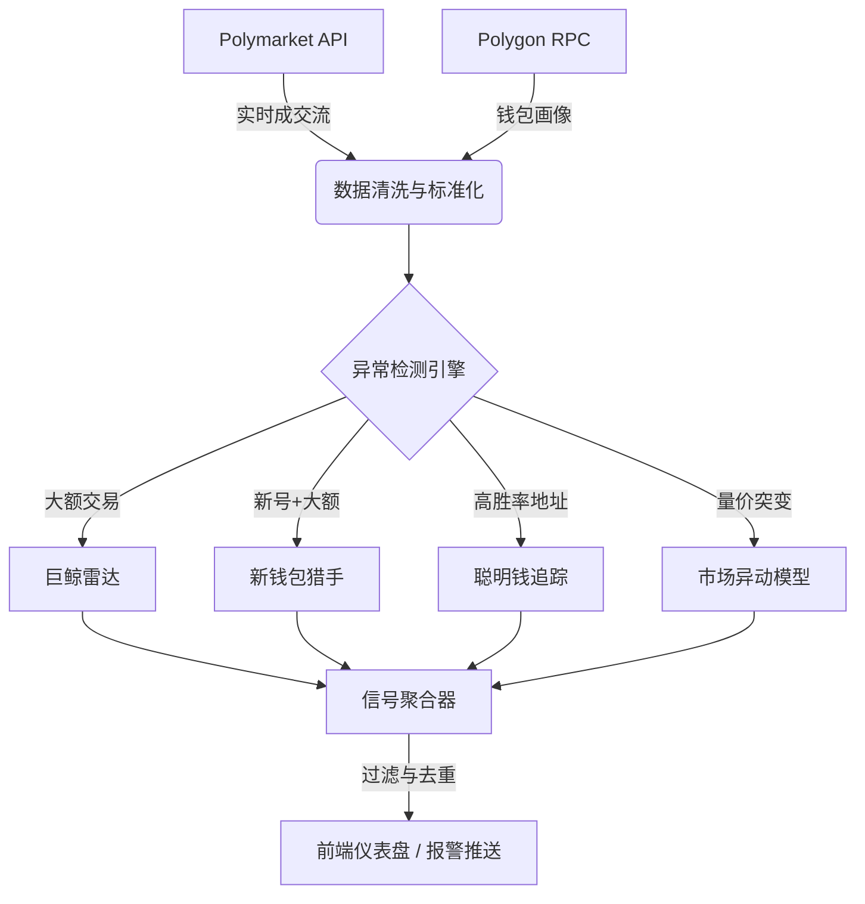

# 纯链上异动扫描器 (Pure On-Chain Anomaly Scanner) 设计方案

## 1. 系统定位
本系统是一个专注于 **Polymarket 预测市场** 的实时金融监控工具。它剥离了所有外部舆情（Twitter/News）依赖，完全基于**交易数据**和**链上行为**来识别异常。

**核心逻辑**：市场价格反映一切信息。如果有人掌握了内幕信息，他们的交易行为（金额、频率、账户新旧）必然会在链上留下痕迹。我们通过统计学异常来反推内幕的存在。

## 2. 核心数据源
系统仅依赖以下两个免费且公开的数据源：
1.  **Polymarket API (CLOB & Gamma API)**
    *   获取实时订单簿（Order Book）、最新成交（Trades）、市场元数据。
    *   成本：$0 (免费)。
2.  **Polygon Scan / RPC 节点**
    *   追踪 USDC 转账记录，分析钱包资金来源（例如：资金是否来自交易所、混币器或已知的大户地址）。
    *   成本：极低（使用公共 RPC 或免费层级的 Infura/Alchemy）。

## 3. 核心检测模块

### 3.1 巨鲸雷达 (Whale Radar)
监控单笔大额交易。
*   **触发条件**：单笔买入金额 > $10,000 (阈值可调)。
*   **分析维度**：
    *   **滑点影响**：该笔交易是否直接吃掉了 5% 以上的深度？（不计成本的买入通常意味着强烈的信心）。
    *   **持仓占比**：该笔交易后，该用户是否成为该市场的前 5 大持有者？

### 3.2 新钱包猎手 (Fresh Wallet Hunter)
专门捕捉为了特定事件而创建的“一次性钱包”。这是内幕交易最典型的特征。
*   **触发条件**：
    1.  钱包首次在 Polymarket 交互。
    2.  资金来源为交易所（CEX）提现或跨链桥，且资金链路短。
    3.  首笔交易即为大额（> $1,000）且方向单一（只买不卖）。
*   **判定逻辑**：新号 + 大额 + 单边下注 = **极高风险/内幕嫌疑**。

### 3.3 聪明钱追踪 (Smart Money Tracker)
基于历史胜率的跟单系统。
*   **机制**：
    1.  维护一个“高胜率地址库”（历史盈利 > $50k 且 胜率 > 60%）。
    2.  实时监控这些地址的动向。
*   **信号**：当 3 个以上的高胜率地址在 1 小时内买入同一个市场的同一侧时，触发“共识信号”。

### 3.4 市场异动 (Market Anomaly)
基于统计学的价格/成交量异常检测。
*   **Z-Score 模型**：计算当前成交量与过去 24 小时均值的标准差。
*   **触发条件**：成交量 Z-Score > 3（即当前成交量是正常波动的 3 倍以上），且价格变动 > 5%。
*   **意义**：捕捉突发事件导致的市场剧烈重估。

## 4. 系统架构图

## 5. 优缺点分析

| 维度 | 纯链上扫描器 (本方案) | 全源情报系统 (含 Twitter) |
| :--- | :--- | :--- |
| **成本** | **极低** (仅需服务器费用) | 高 (需支付 Twitter API 或爬虫费用) |
| **稳定性** | **高** (官方 API 稳定) | 中 (爬虫易失效，第三方服务不稳定) |
| **信号解释性** | 低 (只知道"有人买"，不知道"为什么") | 高 (能关联到具体新闻或推文) |
| **速度** | **极快** (毫秒级链上响应) | 较快 (取决于爬虫频率) |
| **误报率** | 中 (可能把正常新闻反应当成内幕) | 低 (能通过新闻过滤正常波动) |

## 6. 实施路线图
1.  **数据接入**：编写 Python 脚本连接 Polymarket WebSocket，订阅全市场 Trade 数据。
2.  **地址库构建**：回测过去 3 个月的历史数据，筛选出“聪明钱”地址列表。
3.  **实时计算**：部署 Redis 用于存储实时的滑动窗口数据（用于计算 Z-Score）。
4.  **前端展示**：复用已开发的赛博朋克风格仪表盘，移除“舆情”相关板块，增强“资金流向”的可视化。
